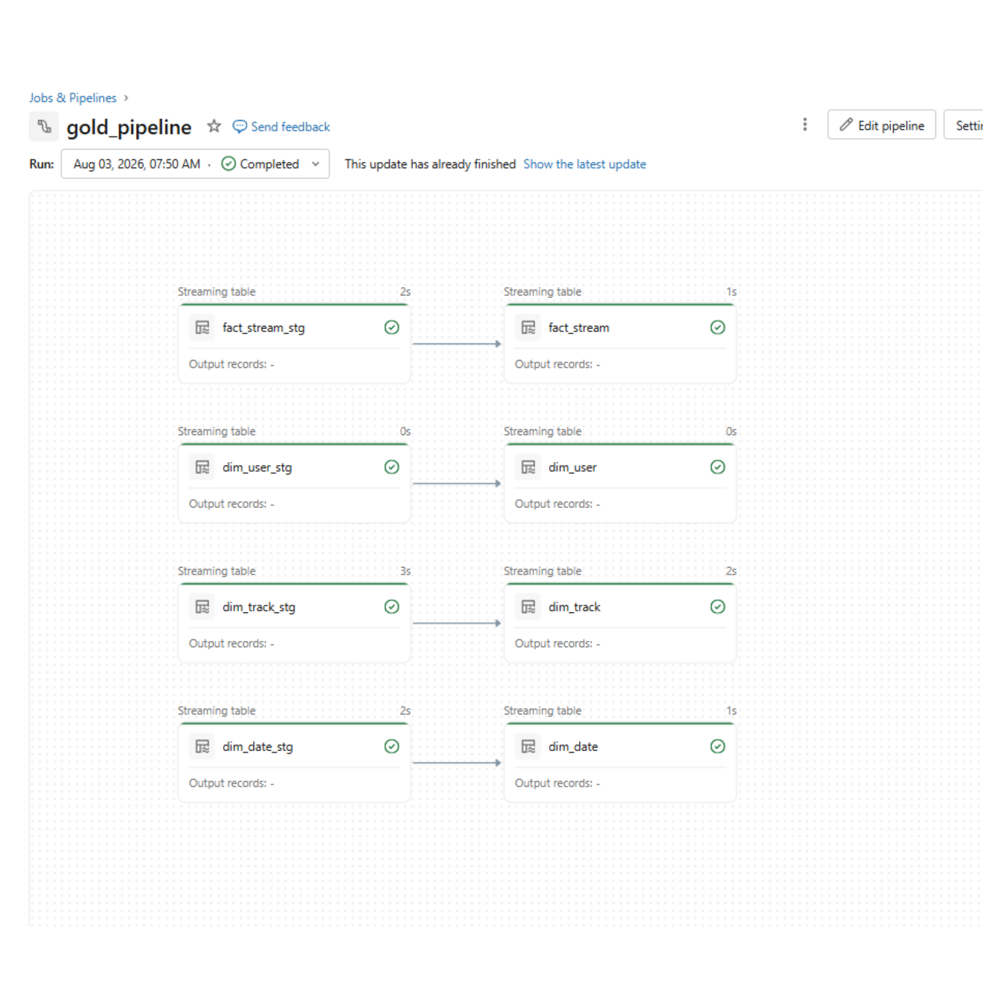
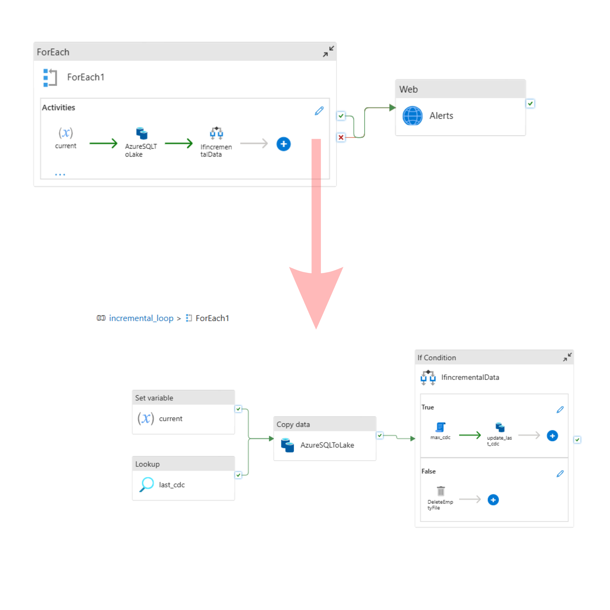
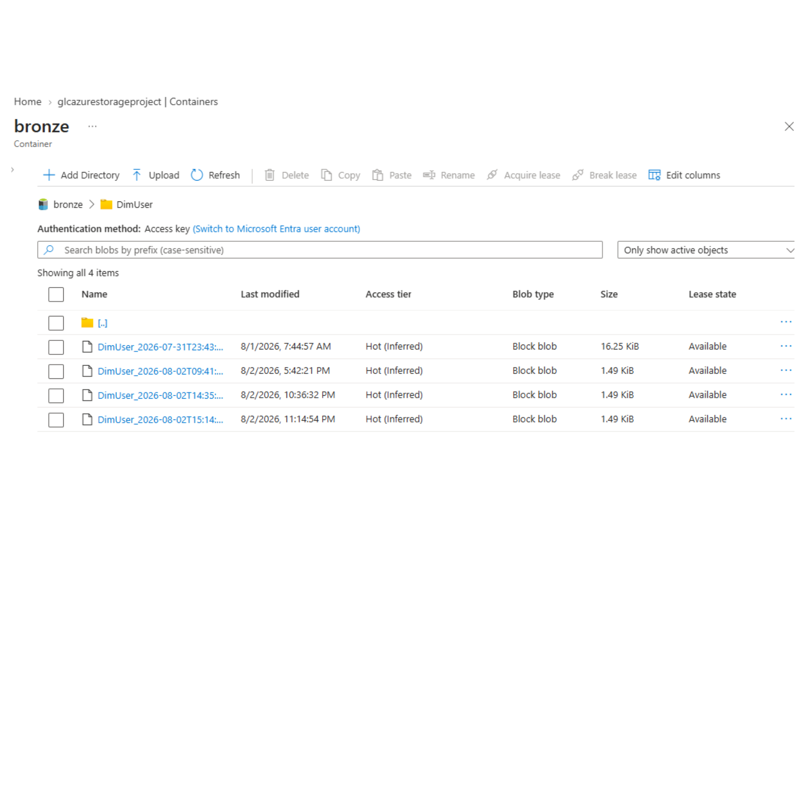
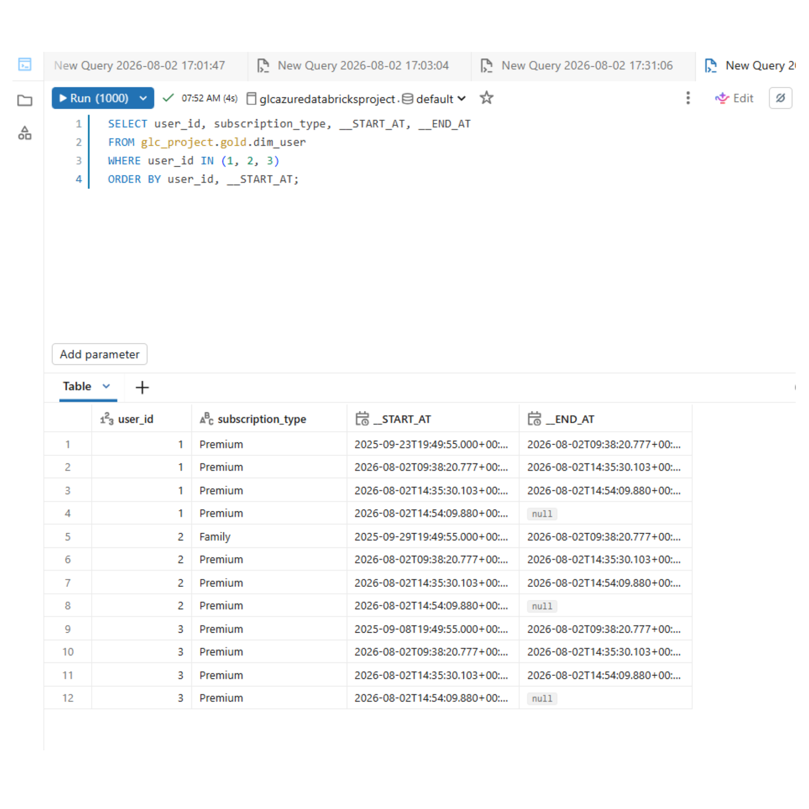
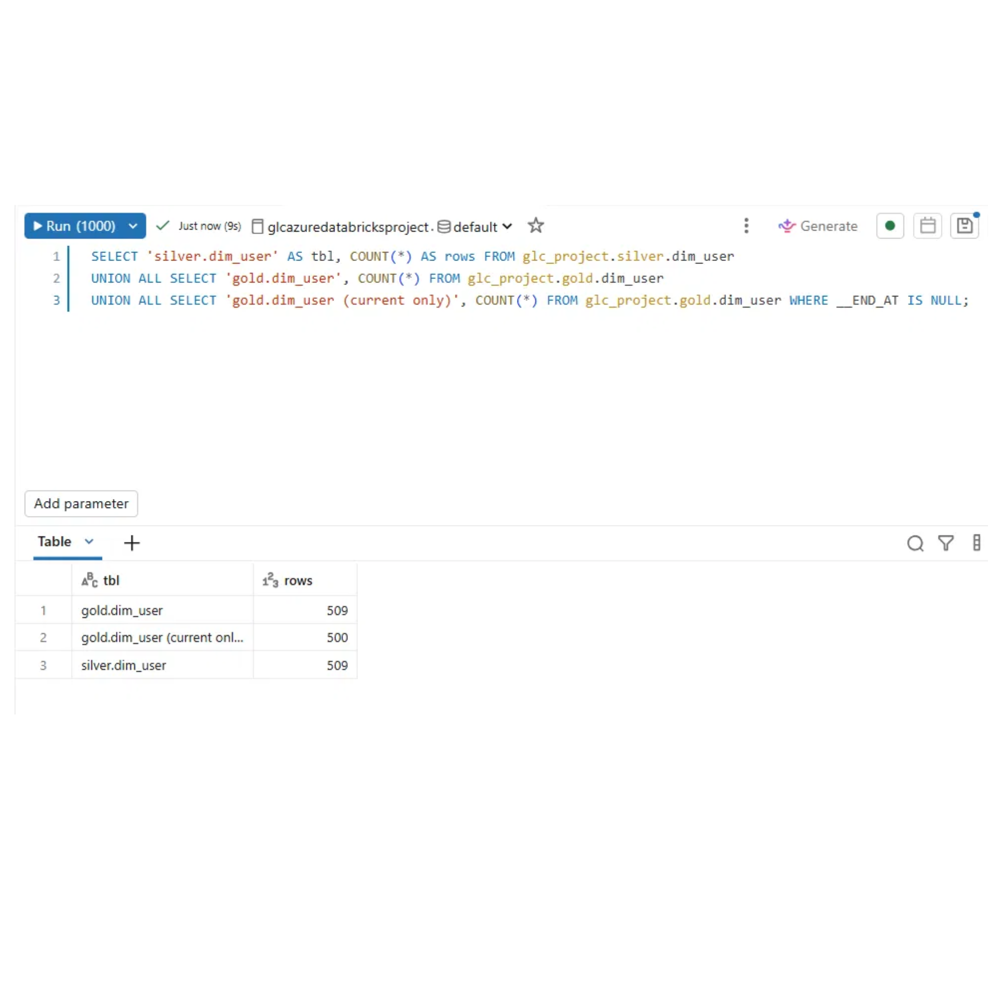
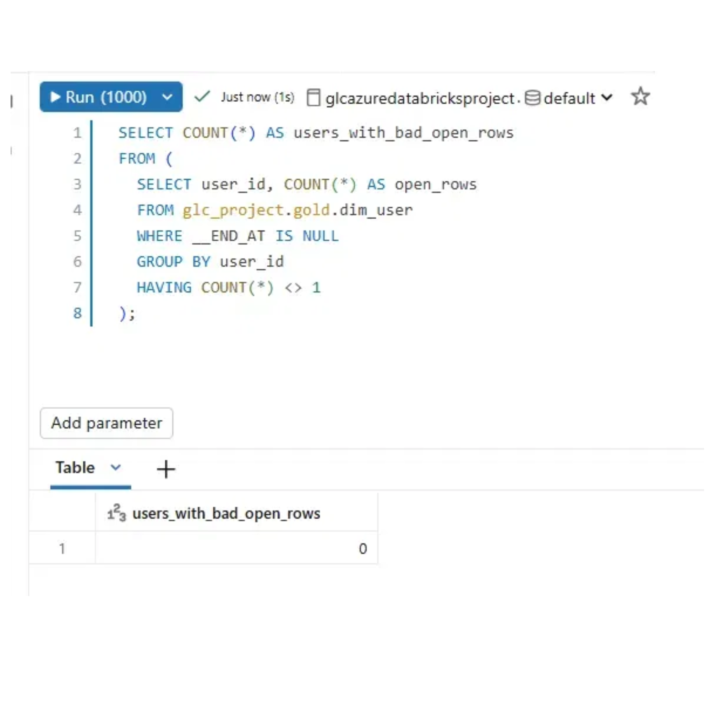
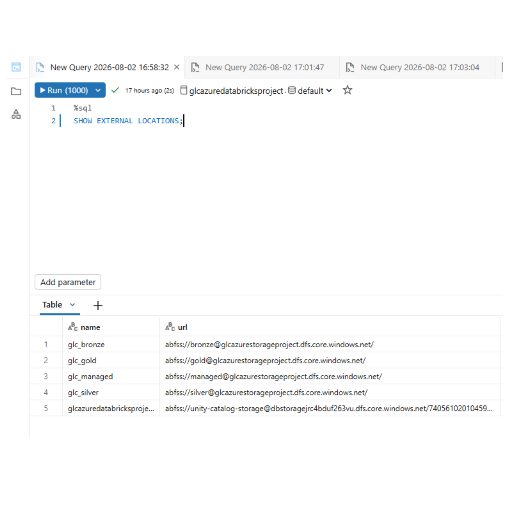
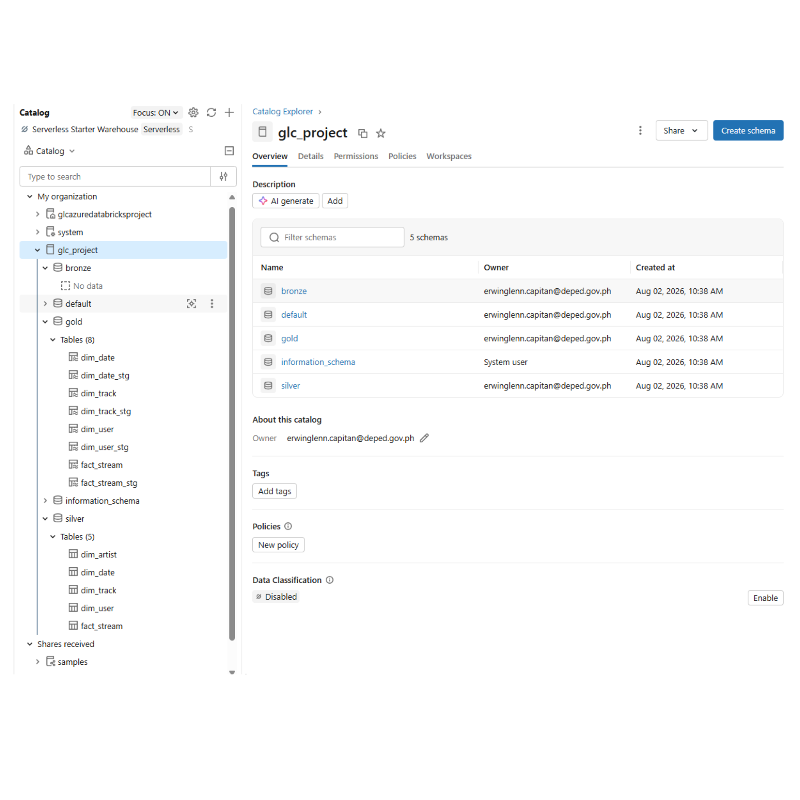

# Azure Data Engineering Project — Incremental Lakehouse with SCD Type 2

An end-to-end data platform built on Azure: watermark-driven incremental extraction from Azure
SQL Database, a medallion lakehouse on ADLS Gen2 governed by Unity Catalog, and a Delta Live
Tables gold layer that tracks dimension history with SCD Type 2.

## The data

The source is a synthetic music-streaming service. Users hold a subscription plan (free, premium,
family) and generate a stream event each time they play a track; tracks belong to artists. Five
tables land from Azure SQL: `DimUser`, `DimTrack`, `DimArtist`, `DimDate`, and `FactStream`.

The reporting problem that shapes the whole design is this: **a user's subscription plan changes
over time.** If someone upgrades from free to premium in March, then "how many hours did premium
users stream in February?" gives the wrong answer unless the warehouse knows what plan they were
on *at the time of each stream*. Overwriting the user row destroys that. So `dim_user` is modelled
as SCD Type 2 — every plan change closes the old row and opens a new one, and a stream event joins
to whichever version was active when it happened.

Orchestration is metadata-driven — one Azure Data Factory pipeline loads all five tables by
iterating over a JSON array, so adding a sixth means editing a parameter, not building a pipeline.



---

## Architecture

```
Azure SQL Database
        │
        │  watermark-based incremental copy (ADF)
        ▼
   bronze/         parquet, per-table folders + cdc watermark files
        │
        │  Auto Loader streaming (Databricks)
        ▼
   silver/         Delta, cleaned and standardised
        │
        │  Delta Live Tables (AUTO CDC)
        ▼
   gold/           Delta, SCD Type 2 dimensions + SCD Type 1 fact
```

| Layer | Format | Contents |
|---|---|---|
| Bronze | Parquet | Raw extracts, one folder per table, plus `*_cdc` watermark files |
| Silver | Delta | All five tables — deduplicated, standardised, `_rescued_data` removed |
| Gold | Delta | `dim_user`, `dim_track`, `dim_date` (SCD2) and `fact_stream` (SCD1) |

**Stack** — Azure Data Factory · Azure SQL Database · ADLS Gen2 · Azure Databricks · Delta Live
Tables · Unity Catalog · PySpark · Delta Lake · Azure Logic Apps

---

## Data model

Gold is a star schema: one fact table at the grain of a single stream event, surrounded by
conformed dimensions.

```
                 ┌──────────────┐
                 │   dim_date   │   date_key   (SCD2)
                 └──────┬───────┘
                        │
┌──────────────┐  ┌─────┴────────┐  ┌──────────────┐
│   dim_user   ├──┤ fact_stream  ├──┤  dim_track   │
│   user_id    │  │  stream_id   │  │  track_id    │
│   (SCD2)     │  │   (SCD1)     │  │   (SCD2)     │
└──────────────┘  └──────────────┘  └──────────────┘
```

| Table | Grain | Key | CDC type | Sequenced by |
|---|---|---|---|---|
| `fact_stream` | one stream event | `stream_id` | Type 1 | `stream_timestamp` |
| `dim_user` | one version of a user | `user_id` | Type 2 | `updated_at` |
| `dim_track` | one version of a track | `track_id` | Type 2 | `updated_at` |
| `dim_date` | one calendar day | `date_key` | Type 2 | `date` |

`dim_user` carries `user_name`, `country`, `subscription_type`, `start_date`, `end_date` and
`updated_at`, plus the `__START_AT` / `__END_AT` validity window that DLT maintains.

**Why the fact is Type 1 while dimensions are Type 2.** A dimension attribute changing is a real
event worth preserving — the user genuinely was on a free plan, then genuinely wasn't. A fact row
changing is a correction: the event happened once, and a restated version supersedes the original
rather than joining it. Keeping history on corrections would double-count.

`dim_artist` is loaded and cleaned through silver but has no gold table — nothing in the current
star schema joins to it. It's staged and ready rather than modelled for its own sake.

---

## Incremental loading

The ADF pipeline (`pipeline/incremental_loop.json`) is a single `ForEach` over a `loop_input`
parameter. Each entry names a table and the column to watermark on:

```json
{ "schema": "dbo", "table": "DimUser", "cdc_col": "updated_at", "from_date": "" }
```

For each table the pipeline:

1. **`current`** — sets the current high-water mark
2. **`last_cdc`** — looks up the previous watermark from `bronze/<Table>_cdc/cdc.json`
3. **`AzureSQLToLake`** — copies only rows newer than that watermark into `bronze/<Table>/`
4. **`IfincrementalData`** — branches on whether anything was actually extracted:
   - **rows found** → `max_cdc` computes the new watermark, `update_last_cdc` persists it
   - **nothing new** → `DeleteEmptyFile` removes the zero-row parquet file ADF wrote anyway

That false branch matters more than it looks. Without it, every no-op run leaves an empty parquet
file in bronze, and Auto Loader downstream treats each one as a new file to process. Deleting them
keeps the streaming layer honest.

A `WebActivity` posts to an Azure Logic App on failure, which sends an alert email.



Proof it works — bronze holds one large file from the initial load and several small ones from
incremental runs:



---

## Silver — Auto Loader

`databricks/silver_dimensions.ipynb` reads each bronze folder as a stream with `cloudFiles`,
applies transformations, and writes to a Unity Catalog Delta table with
`.trigger(availableNow=True)` so each run processes what's arrived and stops.

Transformations live in a shared class rather than being repeated per table
(`databricks/utils/transformations.py`):

```python
df_user  = Reusable.uppercase(df_user, "user_name")
df_user  = Reusable.drop_columns(df_user, "_rescued_data")
df_track = Reusable.bucket_numeric(df_track, "duration_sec", "duration_flag", 150, 300)
```

Silver row counts after the final run:

| Table | Rows |
|---|---|
| `dim_user` | 509 |
| `dim_track` | 500 |
| `dim_artist` | 500 |
| `dim_date` | 365 |
| `fact_stream` | 1,000 |

Bronze `DimUser` also holds 509 rows, so nothing was dropped between layers.

---

## Gold — Delta Live Tables and SCD Type 2

Each gold table is a DLT streaming table fed by `create_auto_cdc_flow`:

```python
dlt.create_auto_cdc_flow(
    target="dim_user",
    source="dim_user_stg",
    keys=["user_id"],
    sequence_by="updated_at",
    stored_as_scd_type=2
)
```

DLT manages `__START_AT` / `__END_AT` automatically. Updating three users three times each produced
four versions apiece — one open row and three closed ones:



### Validating it

Three counts tell the whole story:

| Query | Rows |
|---|---|
| `silver.dim_user` | 509 |
| `gold.dim_user` | 509 |
| `gold.dim_user` where `__END_AT IS NULL` | 500 |

500 distinct users, 9 expired rows (3 users × 3 superseded versions), 509 total. Silver and gold
match because every silver change row became exactly one gold version — nothing dropped, nothing
duplicated.



Counts alone don't prove correctness, though. The failure mode that matters in SCD Type 2 is a key
ending up with two open rows, or none — which breaks every downstream join silently:

```sql
SELECT COUNT(*) AS users_with_bad_open_rows
FROM (
  SELECT user_id, COUNT(*) AS open_rows
  FROM glc_project.gold.dim_user
  WHERE __END_AT IS NULL
  GROUP BY user_id
  HAVING COUNT(*) <> 1
);
```



---

## Governance

Storage is reached through a Unity Catalog storage credential backed by an Azure Access Connector
with a managed identity — no account keys or SAS tokens anywhere in the code. Each container is
registered as an external location.




---

## Repository layout

```
pipeline/        ADF pipeline definitions
dataset/         ADF datasets
linkedService/   ADF linked services
factory/         ADF factory config
loop_input       the metadata array driving the ForEach
databricks/
  silver_dimensions.ipynb          Auto Loader bronze → silver
  utils/transformations.py         shared PySpark transformations
  gold_pipeline/transformations/   DLT definitions, one per gold table
docs/images/     evidence screenshots
```

---

## Build notes

**Python imports across sibling folders.** Databricks doesn't automatically put a notebook's
directory on `sys.path`, and the reported working directory varies. Importing `utils` needed an
explicit fix that adds both the notebook's directory and its parent:

```python
for candidate in (os.getcwd(), os.path.dirname(os.getcwd())):
    if candidate not in sys.path:
        sys.path.append(candidate)
```

**A 4 vCPU regional quota.** The subscription allowed 4 vCPUs in East US total, and the cluster
driver used all four. The all-purpose cluster and the DLT pipeline could never run at the same
time — one had to fully terminate before the other would start. Cluster failures that looked like
Databricks problems were usually just Azure declining to allocate a VM.

**Empty files from no-op runs.** ADF writes a parquet file even when the incremental query returns
nothing, which pollutes bronze and confuses Auto Loader. Hence the `DeleteEmptyFile` branch.

**Auto Loader's `_rescued_data`.** Schema inference adds this column to every stream. Dropping it
in five places was the thing that made a shared transformations class worth building.

---

## A note on the environment

The Azure free trial backing this project has ended, so the live resources are gone. Everything
here — pipeline definitions, notebooks, DLT code, and screenshots captured while the system was
running — reflects a platform that was built and verified end to end before the subscription
lapsed. The screenshots in `docs/images/` are the record of it working.

Built by following an end-to-end Azure data engineering tutorial, with the SCD Type 2 validation,
the reusable transformations class, and the incremental no-op handling worked through and extended
independently.

---

## Author

**Erwin Glenn L. Capitan II**
[LinkedIn](https://linkedin.com/in/erwin-glenn-capitan-ii/) · [GitHub](https://github.com/glcapitan)

Portfolio project built on a synthetic streaming-service dataset.
