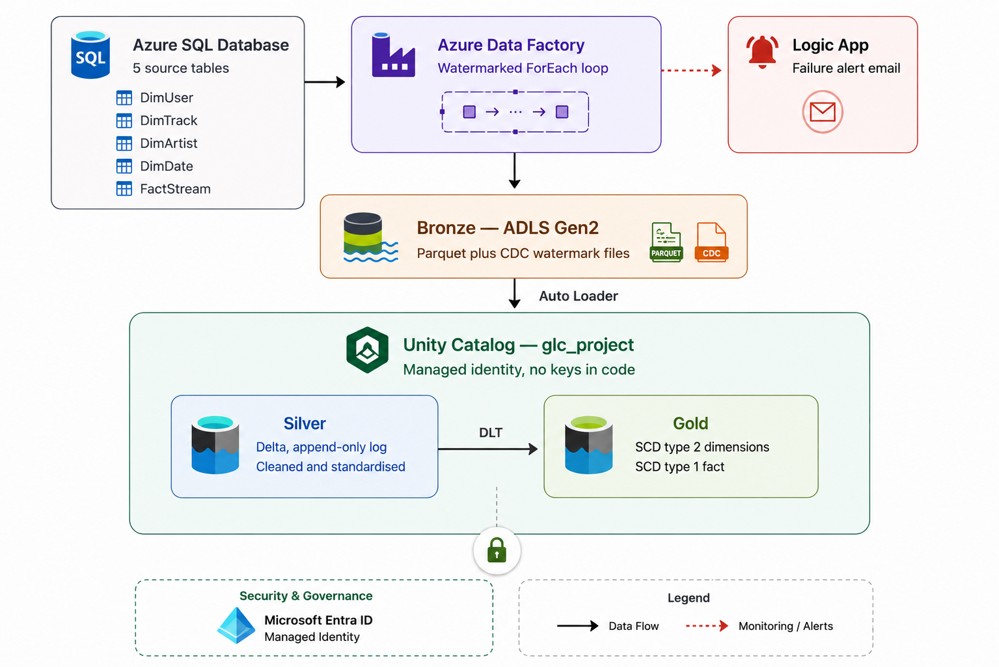

# Azure Data Engineering Project — Incremental Lakehouse with SCD Type 2

An end-to-end data platform on Azure: watermark-driven incremental extraction from Azure SQL
Database, a medallion lakehouse on ADLS Gen2 governed by Unity Catalog, and a Delta Live Tables
gold layer that tracks dimension history with SCD Type 2.



**Stack** — Azure Data Factory · Azure SQL Database · ADLS Gen2 · Azure Databricks · Delta Live
Tables · Unity Catalog · PySpark · Delta Lake · Azure Logic Apps

## What I built

- Metadata-driven ADF ingestion — one `ForEach` pipeline loads every source table from a JSON array
- Watermark-based incremental extraction with explicit handling for no-op runs
- Auto Loader streaming from bronze to silver, with a shared PySpark transformation class
- A gold star schema built with Delta Live Tables, SCD Type 2 on dimensions
- SQL integrity validation of the SCD2 output, not just row counts
- Unity Catalog governance over storage, via managed identity rather than keys
- Both ADF and Databricks Git-backed against this repository

## Repository layout

```
.
├── pipeline/
│   └── incremental_loop.json       metadata-driven ForEach, all five tables
├── dataset/
│   ├── azure_sql_dynamic.json      parameterised source
│   ├── parquet_dynamic.json        parameterised bronze sink
│   └── json_dynamic.json           watermark file read/write
├── linkedService/
│   ├── azure_sql.json
│   └── datalake.json
├── factory/                        ADF factory config
├── loop_input                      the metadata array driving the ForEach
│
├── databricks/
│   ├── silver_dimensions.ipynb     Auto Loader, bronze → silver
│   ├── utils/
│   │   └── transformations.py      shared PySpark transformations
│   └── gold_pipeline/
│       └── transformations/        DLT definitions, one per gold table
│           ├── dim_user.py
│           ├── dim_track.py
│           ├── dim_date.py
│           └── fact_stream.py
│
├── sql/
│   └── schema.sql                  source DDL for Azure SQL
├── scripts/
│   └── generate_data.py            synthetic dataset generator
└── docs/images/                    evidence screenshots
```

---

## The problem the design solves

The source is a synthetic music-streaming service. Users hold a subscription plan (free, premium,
family) and generate a stream event each time they play a track; tracks belong to artists. Five
tables land from Azure SQL: `DimUser`, `DimTrack`, `DimArtist`, `DimDate`, and `FactStream`.

The reporting problem that shapes the whole design: **a user's subscription plan changes over
time.** If someone upgrades from free to premium in March, then "how many hours did premium users
stream in February?" gives the wrong answer unless the warehouse knows what plan they were on *at
the time of each stream*. Overwriting the user row destroys that. So `dim_user` is modelled as SCD
Type 2 — every plan change closes the old row and opens a new one.

---

## Data model

Gold is a star schema: one fact table at the grain of a single stream event, surrounded by
conformed dimensions.

| Table | Grain | Key | CDC type | Sequenced by |
|---|---|---|---|---|
| `fact_stream` | one stream event | `stream_id` | Type 1 | `stream_timestamp` |
| `dim_user` | one version of a user | `user_id` | Type 2 | `updated_at` |
| `dim_track` | one version of a track | `track_id` | Type 2 | `updated_at` |
| `dim_date` | one calendar day | `date_key` | Type 2 | `date` |

`dim_user` carries `user_name`, `country`, `subscription_type`, `start_date`, `end_date` and
`updated_at`, plus the `__START_AT` / `__END_AT` validity window that DLT maintains.

**Why the fact is Type 1 while dimensions are Type 2.** A dimension attribute changing is a real
event worth preserving — the user genuinely was on a free plan, then genuinely wasn't. A fact row
changing is a correction: the event happened once, and a restated version supersedes the original
rather than joining it. Keeping history on corrections would double-count.

**Two known modelling warts, named rather than hidden:**

- `dim_date` is Type 2, sequenced by `date`. A calendar dimension has no meaningful history, so
  Type 1 is the correct choice; this follows the source tutorial's design and is flagged here
  rather than quietly left for a reader to find.
- `fact_stream` carries the natural key `user_id`, not a surrogate key into a specific `dim_user`
  version. See the join section below — this is the current gap, and closing it is the next
  substantive change to the model.

`dim_artist` is loaded and cleaned through silver but has no gold table — nothing in the current
star schema joins to it. Staged and ready rather than modelled for its own sake.

---

## Querying history correctly

<!-- TODO: run both queries against gold, paste the two result numbers, then delete this comment.
     Until the numbers are here this section is a claim, not a demonstration. -->

Because `fact_stream` joins on the natural key, an equi-join fans out across every version of a
user. The join needs a temporal predicate:

```sql
SELECT u.subscription_type,
       SUM(f.listen_duration) / 3600.0 AS hours
FROM glc_project.gold.fact_stream f
JOIN glc_project.gold.dim_user u
  ON f.user_id = u.user_id
 AND f.stream_timestamp >= u.__START_AT
 AND (f.stream_timestamp < u.__END_AT OR u.__END_AT IS NULL)
GROUP BY u.subscription_type;
```

Dropping the last two predicates gives the naive version, which counts a user with three plan
changes four times over. The difference between the two results is the entire point of modelling
the dimension as Type 2.

---

## Incremental loading

`pipeline/incremental_loop.json` is a single `ForEach` over a `loop_input` array parameter. Each
entry names a table and the column to watermark on:

```json
{ "schema": "dbo", "table": "DimUser", "cdc_col": "updated_at", "from_date": "" }
```

Adding a sixth table means editing a parameter, not building a pipeline.

For each table the pipeline:

1. **`current`** — sets the current high-water mark
2. **`last_cdc`** — looks up the previous watermark from `bronze/<Table>_cdc/cdc.json`
3. **`AzureSQLToLake`** — copies only rows newer than that watermark into `bronze/<Table>/`
4. **`IfincrementalData`** — branches on whether anything was actually extracted:
   - **rows found** → `max_cdc` computes the new watermark, `update_last_cdc` persists it
   - **nothing new** → `DeleteEmptyFile` removes the zero-row parquet file ADF wrote anyway

That false branch matters more than it looks. Without it, every no-op run leaves an empty parquet
file in bronze, and Auto Loader downstream treats each one as a new file to process.

A `WebActivity` posts to an Azure Logic App, which sends an alert email.

<!-- TODO before publishing:
     1. The Logic App trigger URL in incremental_loop.json contains a live SAS signature.
        Regenerate the Logic App access key, move the URL to a pipeline parameter or Key Vault
        reference, and scrub it from git history. Do this FIRST.
     2. The Alerts activity has dependencyConditions ["Failed","Succeeded"], which ORs to
        "every run". Drop "Succeeded", then change the sentence above to "on failure".
     3. loop_input inside incremental_loop.json defaults to four tables; the root-level
        loop_input file lists five. Reconcile them, then state the real number. -->


Bronze holds one large file from the initial load and several small ones from incremental runs:


---

## Silver — Auto Loader

`databricks/silver_dimensions.ipynb` reads each bronze folder as a stream with `cloudFiles`,
applies transformations, and writes to a Unity Catalog Delta table with
`.trigger(availableNow=True)` so each run processes what's arrived and stops.

Transformations live in a shared class rather than being repeated per table
(`databricks/utils/transformations.py`):

```python
df_user  = Reusable.uppercase(df_user, "user_name")
df_user  = Reusable.drop_columns(df_user, "_rescued_data")
df_track = Reusable.bucket_numeric(df_track, "duration_sec", "duration_flag", 150, 300)
```

Silver row counts after the final run:

| Table | Rows |
|---|---|
| `dim_user` | 509 |
| `dim_track` | 500 |
| `dim_artist` | 500 |
| `dim_date` | 365 |
| `fact_stream` | 1,000 |

Bronze `DimUser` also holds 509 rows, so nothing was dropped between layers.

---

## Gold — Delta Live Tables and SCD Type 2

Each gold table is a DLT streaming table fed by `create_auto_cdc_flow`:

```python
dlt.create_auto_cdc_flow(
    target="dim_user",
    source="dim_user_stg",
    keys=["user_id"],
    sequence_by="updated_at",
    stored_as_scd_type=2
)
```

DLT manages `__START_AT` / `__END_AT` automatically. Updating three users three times each produced
four versions apiece — one open row and three closed ones:


### Validating it

| Query | Rows |
|---|---|
| `silver.dim_user` | 509 |
| `gold.dim_user` | 509 |
| `gold.dim_user` where `__END_AT IS NULL` | 500 |

500 distinct users, 9 expired rows (3 users x 3 superseded versions), 509 total. Silver and gold
match because every silver change row became exactly one gold version.


Counts alone don't prove correctness. The failure mode that matters in SCD Type 2 is a key ending
up with two open rows, or none — which breaks every downstream join silently:

```sql
SELECT COUNT(*) AS users_with_bad_open_rows
FROM (
  SELECT user_id, COUNT(*) AS open_rows
  FROM glc_project.gold.dim_user
  WHERE __END_AT IS NULL
  GROUP BY user_id
  HAVING COUNT(*) <> 1
);
```

Returns 0.


This check runs manually today. Moving it into a DLT expectation (`@dlt.expect_or_fail`) so the
pipeline fails on a broken validity window — rather than a human noticing later — is the next
change to the gold layer.

---

## Governance

Databricks reaches storage through a Unity Catalog storage credential backed by an Azure Access
Connector with a managed identity — no account keys or SAS tokens in the notebook or DLT code. Each
container is registered as an external location. ADF's linked services use ADF-managed credential
references rather than managed identity; moving them to MI is on the roadmap below.


---

## Scale

This runs on roughly 2,900 source rows across five tables — enough to prove the mechanics, not
enough to exercise performance engineering. At meaningful volume the design would need:

- **Bronze small files.** Incremental runs already produce one small parquet file per execution.
  At high frequency that becomes a listing bottleneck for Auto Loader; bronze would need periodic
  compaction.
- **Gold layout.** `fact_stream` is unpartitioned. At scale it wants liquid clustering (or
  partitioning on `date_key`) plus a regular `OPTIMIZE` / `VACUUM` cycle.
- **Watermark granularity.** A single high-water mark per table serialises extraction. Wide tables
  or high-churn sources would want per-partition watermarks or native CDC.

None of these were needed here, and pretending otherwise would misrepresent what was tested.

---

## Version control

Both halves of the stack are Git-backed against this repository rather than living only inside the
Azure portal.

Azure Data Factory is connected with `main` as the collaboration branch and `adf_publish` as the
publish branch, so every pipeline, dataset, and linked service definition is versioned here as
JSON. The Databricks side uses a Git folder cloned from this repo, with the DLT pipeline's root
folder and source code paths pointed into `databricks/` — so the gold layer is versioned alongside
the ADF definitions rather than drifting as untracked workspace files.

Linking Databricks to GitHub required installing the Databricks GitHub App directly; OAuth account
linking alone returned a push permission error.

Deployment is not automated. The next step is Databricks Asset Bundles or an Azure DevOps release
pipeline.

---

## Build notes

**Python imports across sibling folders.** Databricks doesn't automatically put a notebook's
directory on `sys.path`, and the reported working directory varies. Importing `utils` needed an
explicit fix that adds both the notebook's directory and its parent:

```python
for candidate in (os.getcwd(), os.path.dirname(os.getcwd())):
    if candidate not in sys.path:
        sys.path.append(candidate)
```

**A 4 vCPU regional quota.** The subscription allowed 4 vCPUs in East US total, and the cluster
driver used all four. The all-purpose cluster and the DLT pipeline could never run at the same
time — one had to fully terminate before the other would start. Cluster failures that looked like
Databricks problems were usually just Azure declining to allocate a VM. Free trial subscriptions
are also ineligible for quota increases, so the workflow stayed sequential by necessity.

**Empty files from no-op runs.** ADF writes a parquet file even when the incremental query returns
nothing, which pollutes bronze and confuses Auto Loader. Hence the `DeleteEmptyFile` branch.

**Auto Loader's `_rescued_data`.** Schema inference adds this column to every stream. Dropping it
in five places was the thing that made a shared transformations class worth building.

**DLT edition.** `create_auto_cdc_flow` is rejected by the Core product edition. The pipeline needs
Pro or Advanced.

---

## Environment and provenance

The Azure free trial backing this project has ended, so the live resources are gone. Everything
here — pipeline definitions, notebooks, DLT code, and screenshots captured while the system was
running — reflects a platform that was built and verified end to end before the subscription
lapsed. The screenshots in `docs/images/` are the record of it working.

The build followed an end-to-end Azure data engineering tutorial. What was worked through and
extended independently:

- The SCD Type 2 integrity validation — the open-row check above isn't in the source material
- The reusable transformations class, factored out after `_rescued_data` handling repeated five times
- The no-op branch that deletes empty parquet files before Auto Loader sees them
- The `sys.path` resolution for cross-folder imports in Databricks Git folders

<!-- TODO: rebuilding this requires source DDL and a data generator, neither of which is in the
     repo. Add sql/schema.sql and scripts/generate_data.py, then a "Rebuild" section here. Until
     then nobody but you can verify any of it. -->

## Roadmap

- Move the Logic App URL to Key Vault; ADF linked services to managed identity
- Surrogate keys on `fact_stream`, or a documented point-in-time join convention
- DLT expectations replacing the manual validation queries
- A Power BI dashboard on gold — the consumption layer this warehouse currently lacks
- Databricks Asset Bundles for environment promotion

---

## Author

**Erwin Glenn L. Capitan II**
[LinkedIn](https://linkedin.com/in/erwin-glenn-capitan-ii/) · [GitHub](https://github.com/glcapitan)

Portfolio project built on a synthetic streaming-service dataset.
